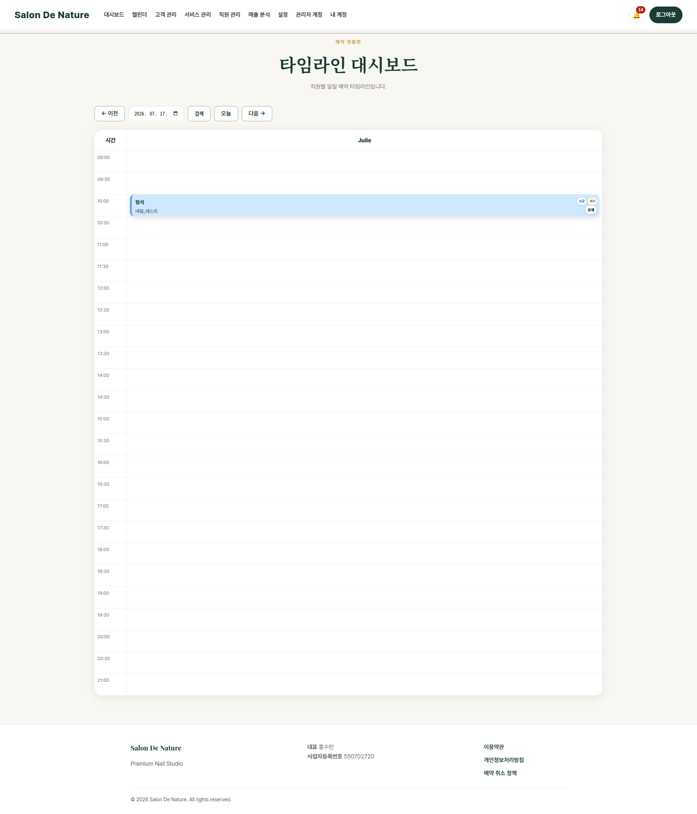

# 관리자 대시보드

**이동 경로:** 관리자 로그인 직후 자동 이동  
또는 상단 메뉴 → `대시보드`

## 5.1 언제 사용하는가

영업 시작 전과 영업 중 가장 먼저 확인하는 화면입니다.

- 오늘 전체 예약 수 확인
- 입금·확정 대기 예약 확인
- 당일 매출 확인
- 예약 현황을 빠르게 파악
- 캘린더나 예약 상세로 이동

## 5.2 주요 영역

### 오늘 예약

오늘 날짜에 등록된 전체 예약 수입니다. 상태가 Pending, Confirmed, Completed 등으로 나뉠 수 있습니다.

### 대기 예약

아직 확정되지 않은 Pending 예약입니다. 고객의 예약금 입금 여부를 확인한 뒤 확정 또는 취소해야 합니다.

### 매출

완료 처리된 예약을 기준으로 집계되는 매출입니다. 예약만 생성하고 완료 처리하지 않으면 매출에 포함되지 않을 수 있습니다.

### 최근 예약 및 운영 현황

최근 생성된 예약이나 오늘 처리해야 할 예약을 확인합니다. 예약을 선택하면 캘린더·상세·타임라인으로 연결됩니다.

## 5.3 권장 사용 순서

1. 오늘 예약 건수 확인
2. Pending 예약 확인
3. 실제 입금 내역과 예약금 상태 대조
4. 입금 완료 예약을 Confirmed로 처리
5. 담당 직원과 시간 배정 확인
6. 영업 종료 전 Completed 또는 No-show 처리
7. 매출 카드 확인

---
