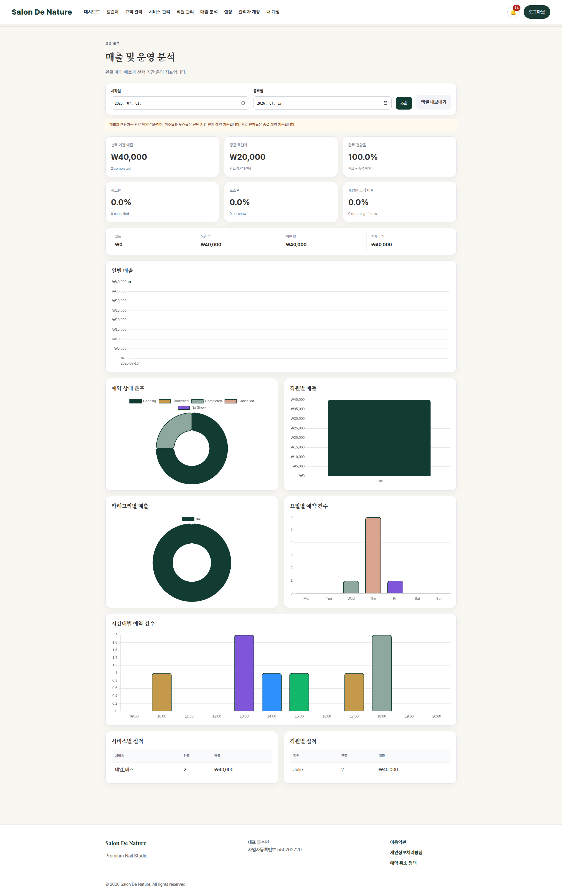

# 매출 및 운영 분석

**이동 경로:** 상단 메뉴 → `매출 분석`

## 14.1 조회 기간

시작일과 종료일을 선택해 원하는 기간의 데이터를 조회합니다.

추천 조회 방식:

- 일일: 당일 마감 확인
- 주간: 요일·시간대 운영 확인
- 월간: 직원·서비스별 매출 평가
- 분기: 메뉴와 인력 운영 방향 검토

## 14.2 KPI 의미

- **매출:** 완료 예약의 서비스 가격 합계
- **평균 객단가:** 완료 예약 매출 ÷ 완료 예약 건수
- **완료 전환율:** 전체 예약 중 완료 비율
- **취소율:** 전체 예약 중 취소 비율
- **노쇼율:** 전체 예약 중 노쇼 비율
- **재방문 고객률:** 해당 기간 고객 중 재방문 고객 비율

## 14.3 차트

- 날짜별 매출 추이
- 예약 상태 분포
- 직원별 매출
- 서비스 카테고리별 매출
- 요일별 예약 수
- 시간대별 예약 수

## 14.4 실적 표

서비스와 직원별로 완료 건수와 매출을 비교할 수 있습니다.

## 14.5 엑셀 다운로드

기간 필터를 적용한 데이터를 엑셀로 내려받아 정산, 회계, 월간 보고에 사용할 수 있습니다.

!!! note "참고"
    완료 처리되지 않은 Confirmed 예약은 실제 시술이 끝났더라도 매출 집계에서 빠질 수 있습니다. 영업 종료 전 완료 처리가 중요합니다.

---
