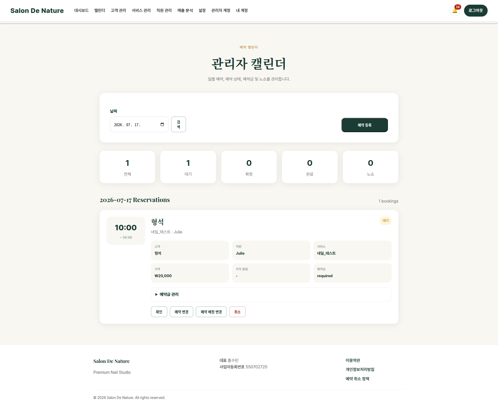

# 예약 캘린더

**이동 경로:** 상단 메뉴 → `캘린더`

## 6.1 언제 사용하는가

- 특정 날짜의 전체 예약을 확인할 때
- 예약금을 확인할 때
- 예약 상태를 변경할 때
- 예약 일시를 변경할 때
- 담당 직원이나 서비스를 바꿀 때
- 전화·현장 예약을 관리자가 직접 등록할 때

## 6.2 날짜 조회

1. 화면 상단 날짜 입력란에서 원하는 날짜를 선택합니다.
2. `검색` 버튼을 누릅니다.
3. 선택한 날짜의 예약 목록이 표시됩니다.

## 6.3 예약 카드에서 확인할 내용

- 고객명
- 시술 서비스
- 담당 직원
- 예약 시작·종료 시간
- 예약 상태
- 예약금 상태
- 고객 메모 또는 예약 메모

## 6.4 예약 등록

**이동 경로:** 캘린더 → `예약 등록`

전화, 카카오톡 또는 현장에서 접수한 예약을 원장이 대신 등록할 때 사용합니다.

권장 순서:

1. 기존 고객 여부를 먼저 고객 관리에서 검색
2. 고객이 없으면 고객 관리에서 신규 고객 등록
3. 캘린더에서 `예약 등록`
4. 고객, 서비스, 직원, 날짜와 시간 선택
5. 예약금 또는 메모 확인
6. 저장

!!! tip "팁"
    같은 고객을 여러 번 신규 등록하지 않도록 고객 관리에서 전화번호를 먼저 검색하십시오.

## 6.5 예약금 처리

예약 카드 또는 상세 화면에서 다음 정보를 확인합니다.

- 예약금 상태
- 결제 링크
- 예약금 메모
- 입금 완료 여부

고객의 실제 입금을 확인한 뒤에만 입금 완료 또는 예약 확정을 처리하십시오.

## 6.6 예약 변경

예약 카드의 `예약 변경` 기능으로 날짜와 시간을 변경합니다.

1. 새 날짜 선택
2. 예약 가능 시간 조회
3. 고객과 합의한 시간 선택
4. 저장
5. 변경된 예약과 문자 발송 이력 확인

## 6.7 담당 직원·서비스 변경

`예약 배정 변경` 기능을 사용합니다.

1. 직원 선택
2. 서비스 선택
3. 날짜와 예약 가능 시간 선택
4. 저장

직원의 담당 서비스나 근무 일정 때문에 선택할 수 없는 시간이 있을 수 있습니다.

## 6.8 상태 변경

예약 상태 변경 기능에서 유효한 다음 상태만 선택할 수 있습니다.

- Pending → Confirmed 또는 Cancelled
- Confirmed → Completed, No-show 또는 Cancelled

취소와 노쇼는 사유 입력이 필수입니다.

---
