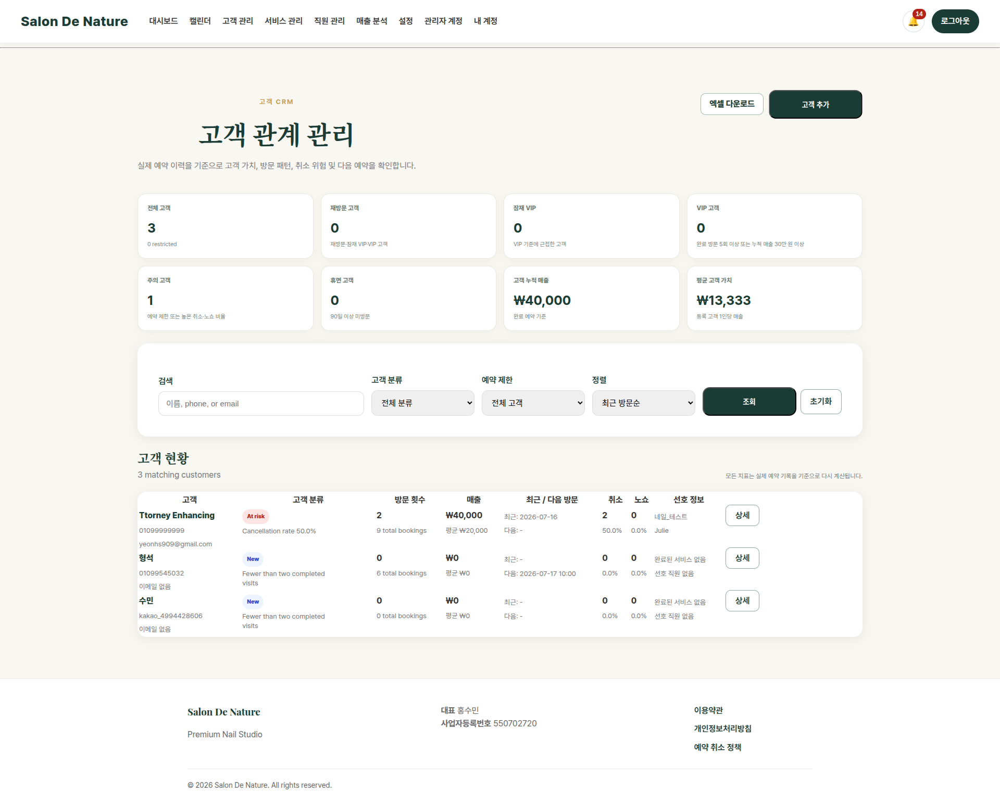

# 고객 관계 관리 CRM

**이동 경로:** 상단 메뉴 → `고객 관리`

## 9.1 언제 사용하는가

- 고객 연락처 검색
- 신규 고객 등록
- 재방문·VIP·휴면 고객 파악
- 노쇼나 취소가 잦은 고객 확인
- 고객별 주의사항과 선호 스타일 기록
- 고객 예약 이력 확인
- 관리자 대신 예약 생성
- 고객 현황 엑셀 다운로드

## 9.2 상단 KPI

고객 수, 세그먼트별 수, 운영상 주의가 필요한 고객 등의 요약 정보가 표시됩니다.

## 9.3 고객 추가

**이동 경로:** 고객 관리 → `고객 추가`

입력 가능한 항목:

- 이름
- 연락처
- 이메일
- 선호 스타일
- 피부 민감도
- 주의·불만 메모
- 관리자 메모

전화 예약 고객을 관리자 예약에 연결하려면 고객을 먼저 등록합니다.

## 9.4 검색과 필터

### 검색

고객 이름, 연락처 등으로 고객을 찾습니다.

### 고객 분류

- **신규**
- **재방문**
- **잠재 VIP**
- **VIP**
- **휴면**
- **주의**

### 예약 제한

- 전체 고객
- 일반
- 예약 제한

### 정렬

- 최근 방문순
- 매출 높은순
- 방문 많은순
- 노쇼 높은순
- 운영 위험 높은순
- 고객 이름순

필터를 초기 상태로 돌리려면 `초기화`를 누릅니다.

## 9.5 고객 세그먼트 의미

| 분류 | 의미 |
|---|---|
| 신규 | 아직 완료 방문이 없거나 첫 방문 단계 |
| 재방문 | 두 번 이상 방문한 일반 재방문 고객 |
| 잠재 VIP | 방문·매출이 증가해 VIP 가능성이 있는 고객 |
| VIP | 방문 횟수 또는 매출이 높은 핵심 고객 |
| 휴면 | 과거 방문 후 장기간 재방문하지 않은 고객 |
| 주의 | 노쇼·취소·예약 제한 등 운영상 확인이 필요한 고객 |

세그먼트는 예약·매출·방문 기록에 따라 자동 계산됩니다.

## 9.6 엑셀 다운로드

**이동 경로:** 고객 관리 → `엑셀 다운로드`

현재 고객 현황을 엑셀 파일로 저장합니다. 내부 운영 자료이므로 고객 개인정보가 외부에 노출되지 않도록 관리하십시오.

## 9.7 고객 상세

**이동 경로:** 고객 관리 → 고객 행의 `상세`

고객 상세에서 확인·수정할 수 있는 내용:

- 기본 연락처
- 선호 스타일
- 피부 민감도
- 주의·불만 메모
- 관리자 메모
- 자동 세그먼트와 선정 이유
- 선호 서비스와 담당 직원
- 방문 횟수와 누적 매출
- 평균 객단가와 방문 주기
- 노쇼·취소 위험
- 전체 예약 이력
- 고객 비밀번호 초기화
- 해당 고객의 관리자 예약 생성

!!! warning "중요"
    피부 민감도, 불만, 주의사항은 시술 안전과 고객 응대에 직접 관련됩니다. 직원이 알아야 할 핵심 정보는 명확하고 객관적으로 기록하십시오.

---
