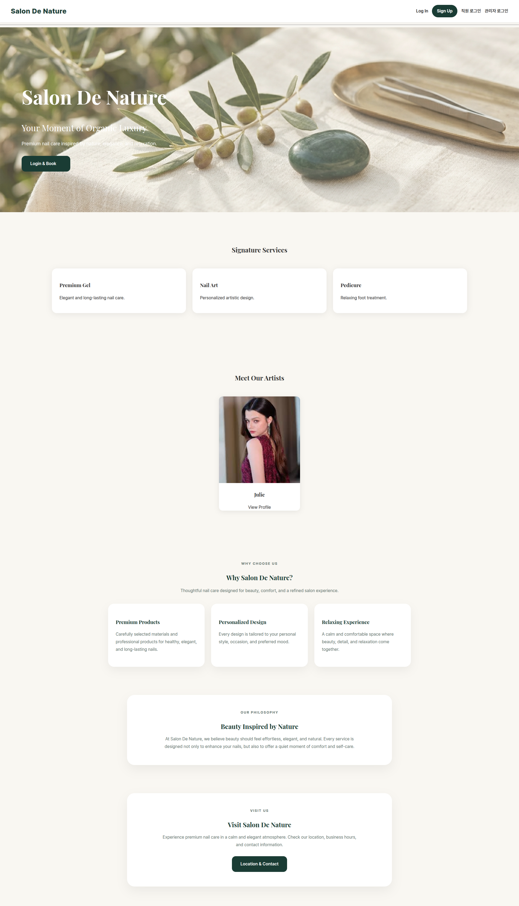
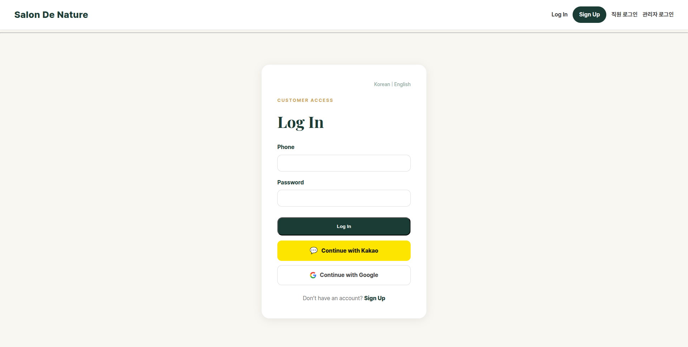
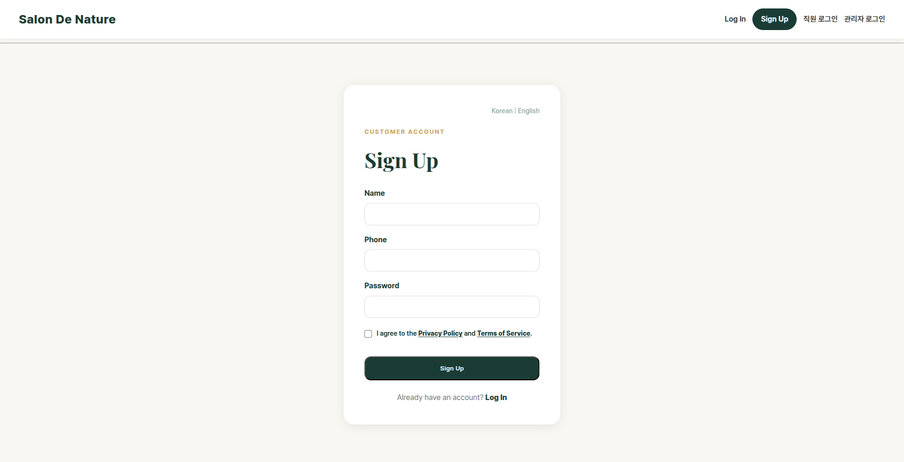
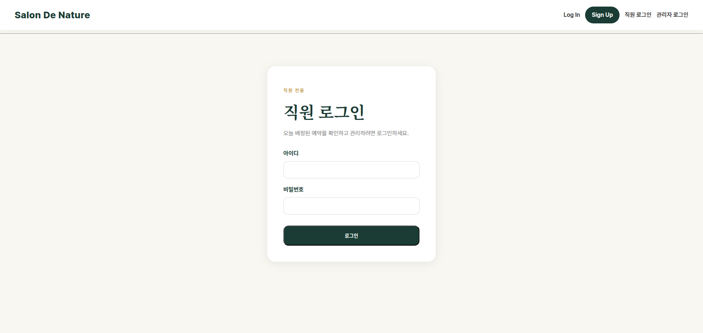

# 처음 시작하기

## 1. 이 설명서의 사용법

각 페이지는 다음 순서로 설명합니다.

1. **이동 경로**: 홈페이지 또는 다른 관리자 화면에서 해당 페이지에 들어가는 방법
2. **언제 사용하는지**: 실제 영업 중 어떤 상황에서 사용하는 페이지인지
3. **화면 기능**: 버튼, 카드, 표, 필터가 무엇을 의미하는지
4. **권장 사용 순서**: 실수 없이 처리하기 위한 작업 순서
5. **주의사항**: 되돌리기 어렵거나 고객에게 문자가 발송될 수 있는 작업

!!! warning "중요"
    예약 상태 변경, 취소, 노쇼, 예약금 확인은 고객 기록과 매출 통계에 영향을 줍니다. 처리 전 고객명·날짜·시간·담당 직원을 다시 확인하십시오.

---

## 2. 시스템 전체 구조

Salon De Nature 시스템에는 세 종류의 사용자가 있습니다.

| 사용자 | 주요 목적 | 로그인 위치 |
|---|---|---|
| 고객 | 예약 생성·조회·변경·취소 | 홈페이지 → `Log In` |
| 직원 | 자신의 오늘 일정과 캘린더 확인, 시술 완료 처리 | 홈페이지 → `직원 로그인` |
| 관리자/원장 | 전체 예약·고객·직원·서비스·매출·문자·설정 관리 | 홈페이지 → `관리자 로그인` |

관리자 로그인 후 상단 메뉴에는 다음 항목이 표시됩니다.

- **대시보드**
- **캘린더**
- **고객 관리**
- **서비스 관리**
- **직원 관리**
- **매출 분석**
- **설정**
- **관리자 계정**
- **내 계정**
- **알림 종 아이콘**
- **로그아웃**

일부 세부 페이지는 상단 메뉴에 직접 표시되지 않습니다.

| 세부 페이지 | 들어가는 방법 |
|---|---|
| 예약 상세 | 캘린더 또는 타임라인에서 예약 선택 → `전체 상세` |
| 타임라인 | 관리자 대시보드의 타임라인 관련 버튼 또는 캘린더 예약 상세에서 이동 |
| 고객 상세 | 고객 관리 목록 → 해당 고객의 `상세` |
| 직원 편집 | 직원 관리 → 해당 직원의 편집 버튼 |
| 직원 근무 일정 | 직원 관리 → 해당 직원의 `일정 관리` |
| 직원 담당 서비스 | 직원 관리 → 해당 직원의 `서비스 관리` |
| 문자 템플릿 | 알림센터 → `문자 템플릿` |
| 알림센터 | 우측 상단 종 아이콘 → `전체 알림 보기` |

---

## 3. 홈페이지와 로그인

### 홈페이지

**이동 경로:** 브라우저에서 Salon De Nature 홈페이지 주소 접속

홈페이지는 고객이 처음 접하는 공개 화면입니다.

주요 기능은 다음과 같습니다.

- 샵과 시술 서비스 소개
- 고객 로그인 및 회원가입
- 직원 로그인
- 관리자 로그인
- 고객 예약 페이지 진입
- 연락처, 개인정보 처리방침, 이용약관 확인

원장님은 홈페이지에서 고객에게 보이는 문구·서비스·대표 이미지가 정상인지 주기적으로 확인하는 것이 좋습니다.

---

### 관리자 로그인

**이동 경로:** 홈페이지 우측 상단 → `관리자 로그인`

1. 관리자 아이디와 비밀번호를 입력합니다.
2. 로그인 버튼을 누릅니다.
3. 로그인에 성공하면 관리자 대시보드로 이동합니다.

!!! danger "주의"
    관리자 계정은 예약, 고객 개인정보, 매출 정보에 접근할 수 있습니다. 공용 컴퓨터에 비밀번호를 저장하지 말고 사용 후 반드시 로그아웃하십시오.

---

### 고객 로그인과 회원가입

고객 문의에 대응할 때 참고하는 화면입니다.

**고객 로그인 이동 경로:** 홈페이지 → `Log In`

고객은 일반 로그인 외에 연결된 소셜 로그인 기능을 사용할 수 있습니다.

**회원가입 이동 경로:** 홈페이지 → `Sign Up`

고객이 예약하려면 먼저 로그인 또는 회원가입이 필요합니다. 가입 후 고객 대시보드에서 예약을 진행합니다.

---

### 직원 로그인

**이동 경로:** 홈페이지 → `직원 로그인`

직원 계정은 원장이 관리자 화면의 **직원 관리**에서 생성합니다. 직원은 자신의 예약만 확인하고 완료 처리할 수 있습니다.

---

## 4. 관리자 화면 공통 사용법

관리자 로그인 후 모든 관리자 페이지 상단에는 공통 메뉴가 있습니다.

### 메뉴 이동

| 메뉴 | 기능 |
|---|---|
| 대시보드 | 오늘 예약, 대기 예약, 매출 등 핵심 현황 확인 |
| 캘린더 | 날짜별 전체 예약 확인 및 예약 처리 |
| 고객 관리 | 고객 검색, CRM 세그먼트, 고객 메모, 예약 이력 |
| 서비스 관리 | 시술명, 가격, 시간, 예약금, 활성화 상태 관리 |
| 직원 관리 | 직원 계정, 프로필, 근무 일정, 담당 서비스 관리 |
| 매출 분석 | 기간별 매출, 예약 상태, 직원·서비스별 실적 |
| 설정 | 예약금, 계좌, 노쇼 제한, 승인 방식, 관리자 문자 설정 |
| 관리자 계정 | 추가 관리자 계정 관리 |
| 내 계정 | 현재 관리자 비밀번호 변경 |

### 알림 종 아이콘

상단 우측의 종 아이콘에는 읽지 않은 알림 수가 표시됩니다.

- 종을 누르면 최근 알림을 바로 확인할 수 있습니다.
- 알림을 누르면 관련 예약 또는 타임라인으로 이동합니다.
- `전체 알림 보기`를 누르면 알림센터로 이동합니다.

### 모바일 사용

모바일에서는 메뉴가 여러 줄 또는 접이식 형태로 보일 수 있습니다. 예약 상세 팝업이 열리면 팝업 내부를 스크롤해 하단 기능을 사용할 수 있습니다.

---
