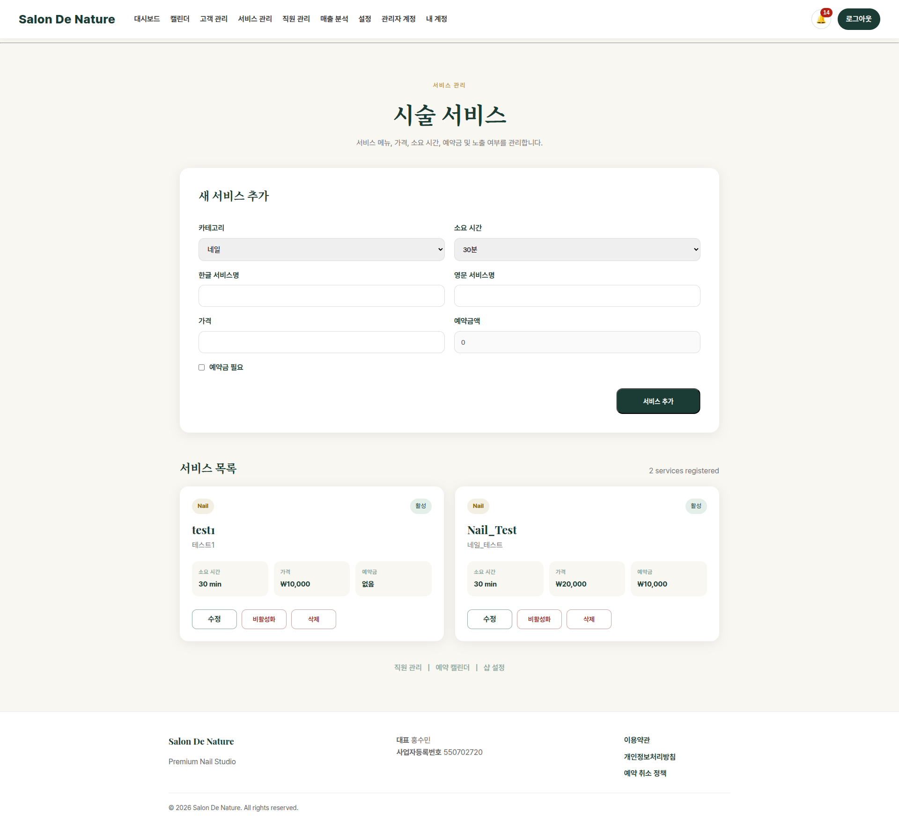

# 서비스 관리

**이동 경로:** 상단 메뉴 → `서비스 관리`

## 10.1 언제 사용하는가

- 신규 시술 메뉴 추가
- 가격 변경
- 시술 소요시간 변경
- 예약금 변경
- 고객 예약 화면에서 서비스 노출 여부 설정

## 10.2 서비스 추가

입력 항목:

- 카테고리
- 소요 시간
- 한글 서비스명
- 영문 서비스명
- 가격
- 예약금액

서비스를 추가한 뒤에는 해당 서비스를 담당할 직원을 연결해야 고객 예약 가능 시간이 정상적으로 표시됩니다.

## 10.3 서비스 수정

서비스 목록의 편집 기능으로 이름, 가격, 시간, 예약금을 수정합니다.

기존 예약의 가격 처리 방식은 시스템 구조에 따라 기존 예약 시점 정보 또는 현재 서비스 가격을 참조할 수 있으므로, 큰 가격 변경 전에는 진행 중인 예약을 확인하십시오.

## 10.4 활성화·비활성화

- **활성화:** 고객이 예약 가능한 서비스
- **비활성화:** 기존 기록은 유지하지만 신규 예약에서 제외하는 용도

과거 매출 이력이 있는 서비스는 삭제보다 비활성화를 권장합니다.

## 10.5 삭제

서비스 삭제는 과거 예약과 연결되어 제한될 수 있습니다. 운영 중인 서비스는 먼저 비활성화하고 기록 보존 여부를 확인하십시오.

---
