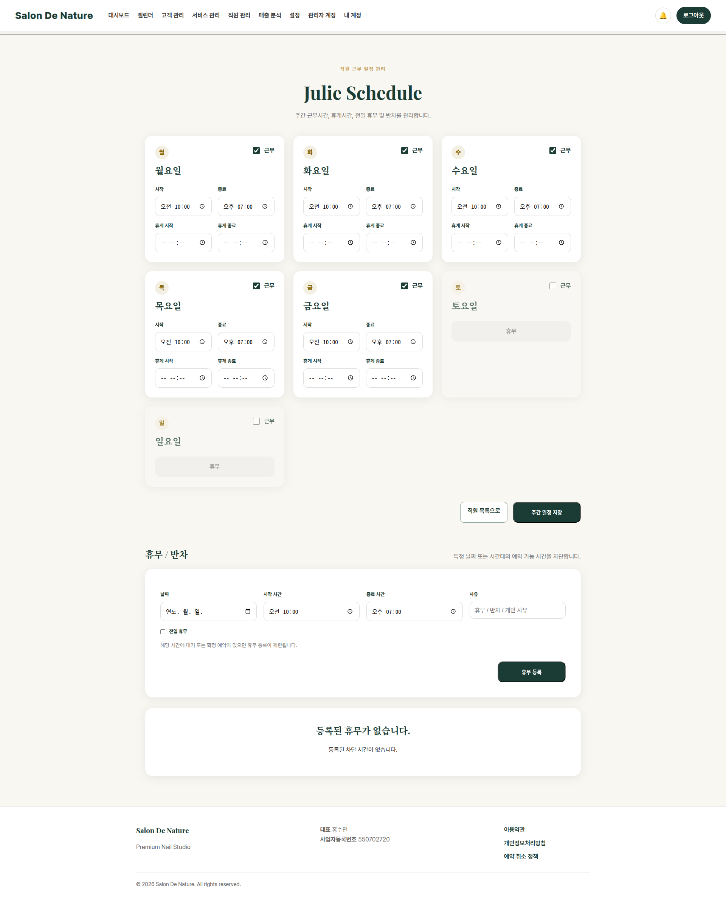

# 직원별 근무 일정과 휴무

**이동 경로:** 상단 메뉴 → `직원 관리` → 해당 직원의 `일정 관리`

## 12.1 정규 근무시간

요일별로 다음 정보를 설정합니다.

- 근무 여부
- 출근 시간
- 퇴근 시간
- 휴게시간 또는 예약 제외 시간

고객 예약 가능 시간은 직원 근무시간, 서비스 소요시간, 기존 예약, 휴무 정보를 함께 반영해 계산됩니다.

## 12.2 휴무·반차·교육·개인 일정

직원별 예약 불가 기간을 등록할 수 있습니다.

예시:

- 종일 휴무
- 오전 반차
- 오후 반차
- 교육
- 출장
- 개인 일정

## 12.3 변경 전 확인

근무시간을 줄이거나 휴무를 등록하기 전에 해당 기간에 이미 확정된 예약이 있는지 캘린더에서 먼저 확인하십시오. 일정 설정만 바꿔도 기존 예약이 자동 취소되는 것은 아니므로 별도 조정이 필요합니다.

---
