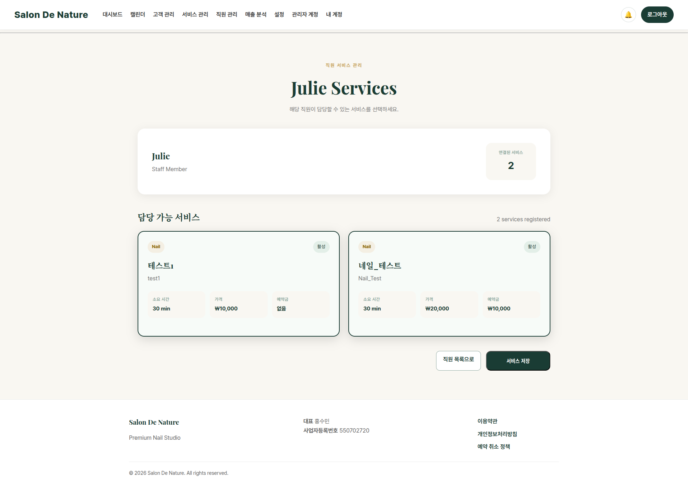

# 직원별 담당 서비스

**이동 경로:** 상단 메뉴 → `직원 관리` → 해당 직원의 `서비스 관리`

직원이 실제로 제공할 수 있는 서비스만 선택합니다.

예시:

- A 디자이너: 젤 네일, 아트 네일
- B 디자이너: 페디큐어, 케어
- 원장: 전체 서비스

고객이 서비스를 선택하면 해당 서비스를 담당할 수 있는 직원만 예약 후보로 표시됩니다.

!!! warning "중요"
    신규 서비스를 추가했는데 예약 화면에 직원이 나타나지 않는 경우, 가장 먼저 직원별 담당 서비스 연결을 확인하십시오.

---
