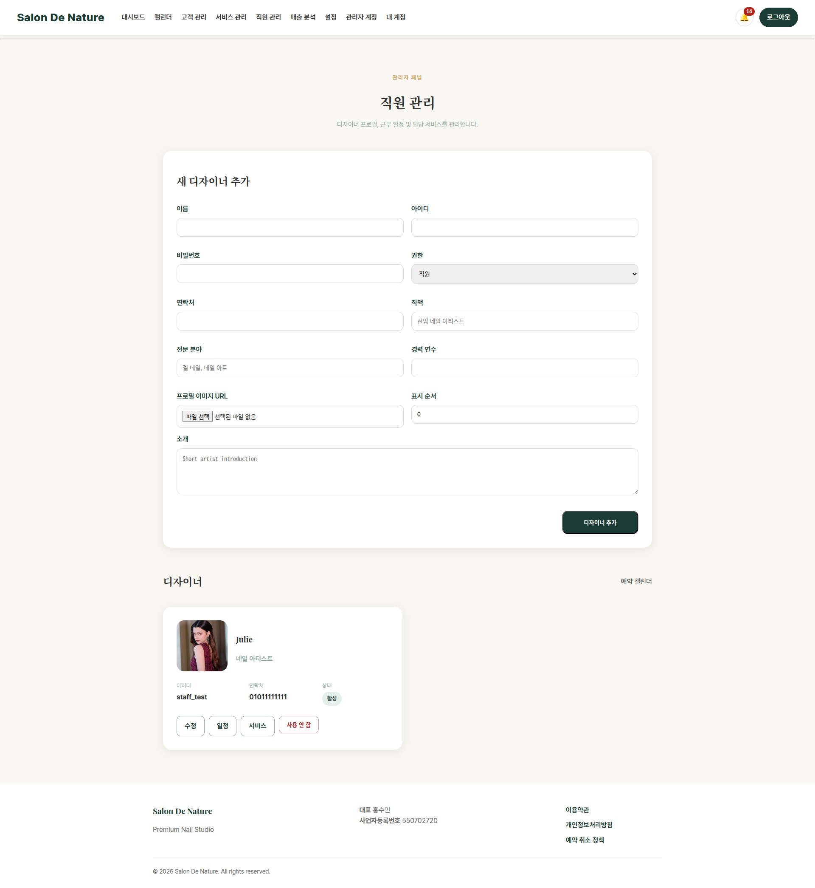

# 직원 관리

**이동 경로:** 상단 메뉴 → `직원 관리`

## 11.1 언제 사용하는가

- 새 디자이너 계정 등록
- 직원 프로필 수정
- 직원 로그인 계정 관리
- 예약 노출 순서 변경
- 직원 활성화·비활성화
- 근무시간과 휴무 설정
- 담당 가능 서비스 연결

## 11.2 새 직원 추가

입력 항목:

- 이름
- 로그인 아이디
- 비밀번호
- 권한
- 연락처
- 직책
- 전문 분야
- 경력 연수
- 프로필 이미지
- 표시 순서
- 소개

등록 후 반드시 다음 두 작업을 이어서 진행하십시오.

1. **근무 일정 설정**
2. **담당 서비스 설정**

둘 중 하나가 빠지면 고객 예약 화면에서 해당 직원의 예약 가능 시간이 나타나지 않을 수 있습니다.

## 11.3 직원 활성화·비활성화

퇴사, 휴직 또는 예약 중단 직원은 비활성화합니다. 과거 예약 기록 보존을 위해 삭제보다 비활성화가 안전합니다.

## 11.4 표시 순서

고객 예약 화면이나 직원 목록에서 보이는 순서를 조정합니다. 원장 또는 대표 디자이너를 앞에 표시할 때 사용합니다.

---
