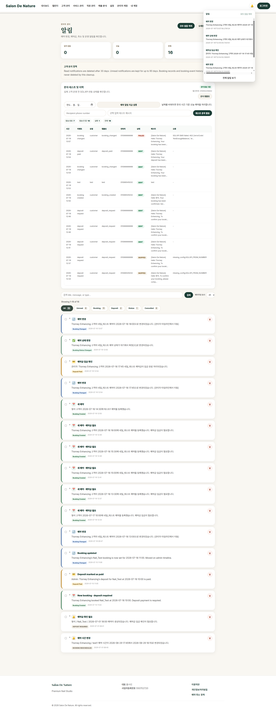

# 알림센터

**이동 경로:** 우측 상단 종 아이콘 → `전체 알림 보기`

## 16.1 알림 종류

- 신규 예약
- 예약 변경
- 예약 취소
- 예약금 관련 처리
- 상태 변경
- 시스템 또는 문자 발송 관련 알림

## 16.2 필터와 검색

- 읽지 않음
- 오늘
- 전체
- 검색어
- 페이지당 표시 수

## 16.3 개별 처리

- 알림 클릭: 관련 페이지 이동
- 읽음 처리
- 삭제

## 16.4 일괄 처리

체크박스로 여러 알림을 선택한 뒤 일괄 읽음 또는 삭제를 수행할 수 있습니다.

## 16.5 예약 리마인더 실행

관리자 화면에서 예약 리마인더를 수동 실행할 수 있습니다. 자동 스케줄러가 정상 설정되어 있다면 일반적으로 수동 실행은 장애 확인이나 재처리 시에만 사용합니다.

## 16.6 SMS 테스트

SOLAPI 연결 후 설정된 발신번호와 관리자 수신번호로 테스트 문자를 보내 실제 발송 여부를 확인합니다.

---
