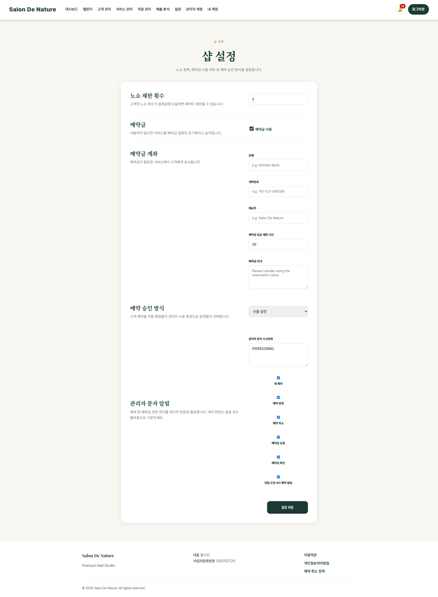

# 샵 설정

**이동 경로:** 상단 메뉴 → `설정`

## 15.1 노쇼 제한 횟수

고객의 누적 노쇼가 설정 횟수에 도달하면 예약 제한 또는 주의 고객으로 관리할 수 있습니다.

## 15.2 예약금

- 기본 예약금 사용 여부
- 예약금 금액
- 서비스별 예약금과의 관계

서비스별 예약금이 별도로 설정되어 있다면 서비스 설정도 함께 확인하십시오.

## 15.3 예약금 계좌

고객에게 안내할 은행명, 계좌번호, 예금주 정보를 설정합니다. 변경 후 실제 고객 예약 화면과 문자 템플릿에 올바르게 표시되는지 확인하십시오.

## 15.4 예약 승인 방식

운영 정책에 따라 예약 생성 직후 상태 또는 관리자 확인 절차가 달라질 수 있습니다.

일반적인 권장 흐름:

1. 고객 예약 생성
2. Pending
3. 예약금 입금 확인
4. 관리자가 Confirmed 처리

## 15.5 관리자 문자 알림

다음 이벤트별 관리자 문자 수신 여부를 설정할 수 있습니다.

- 신규 예약
- 예약 변경
- 예약 취소
- 예약금 요청
- 예약금 확인
- 예약 당일 리마인드

관리자 수신 번호가 정확한지 확인하십시오.

---
