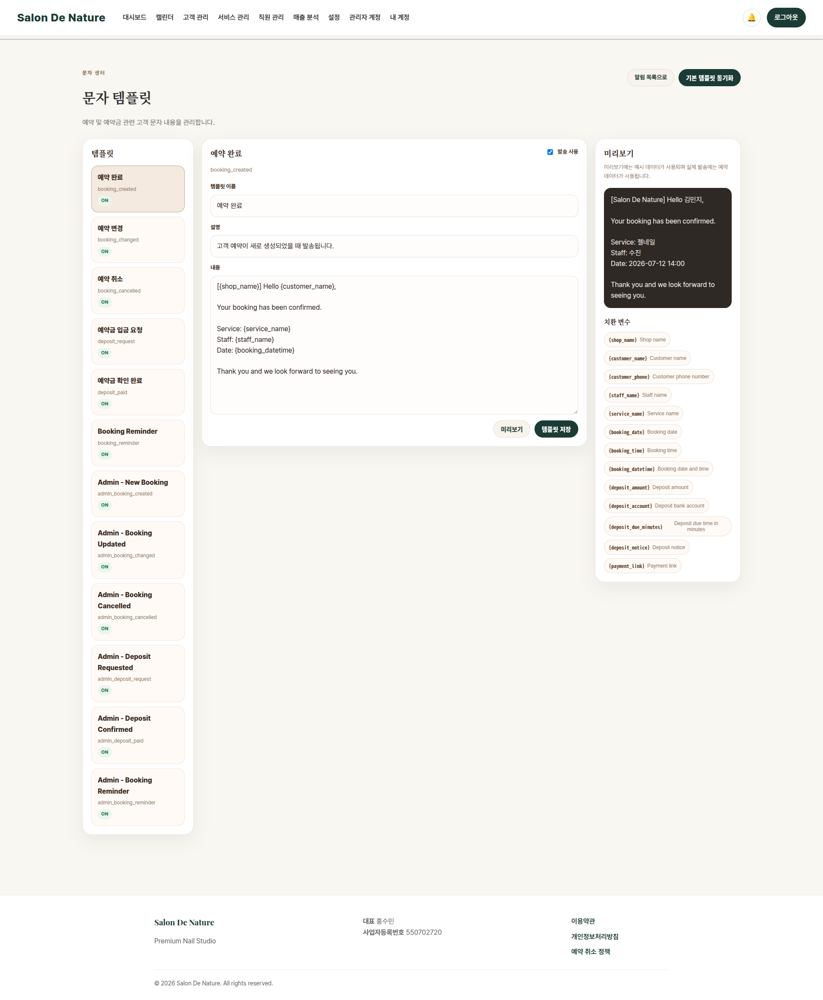

# 문자 템플릿 관리

**이동 경로:** 알림센터 → `문자 템플릿`

## 17.1 템플릿 종류

- 예약 생성
- 예약 변경
- 예약 취소
- 예약금 요청
- 예약금 확인
- 예약 당일 리마인드
- 각 이벤트의 관리자용 문자

## 17.2 수정 방법

1. 왼쪽 목록에서 템플릿 선택
2. 사용 여부 확인
3. 문자 내용을 수정
4. 치환 변수 버튼으로 고객명, 날짜, 시간, 서비스명 등을 삽입
5. 미리보기 확인
6. 저장

## 17.3 치환 변수

치환 변수는 실제 발송 시 예약 정보로 자동 변경됩니다.

예:

- 고객명
- 서비스명
- 담당 직원
- 예약 날짜
- 예약 시간
- 예약금
- 계좌정보

변수 표기를 임의로 수정하면 실제 값으로 변환되지 않을 수 있으므로 화면의 변수 버튼을 사용하십시오.

## 17.4 실발송 전 확인

1. SOLAPI 계정과 API 키
2. 등록·승인된 발신번호
3. 충전 잔액
4. 서버의 SMS 발송 활성화 설정
5. 고객 연락처 형식
6. 템플릿 미리보기
7. 테스트 발송 결과

---
