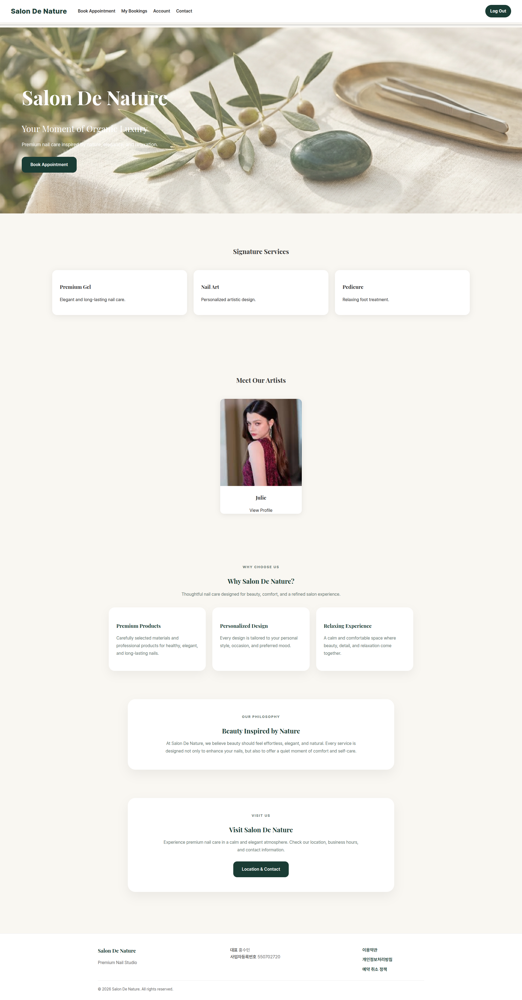
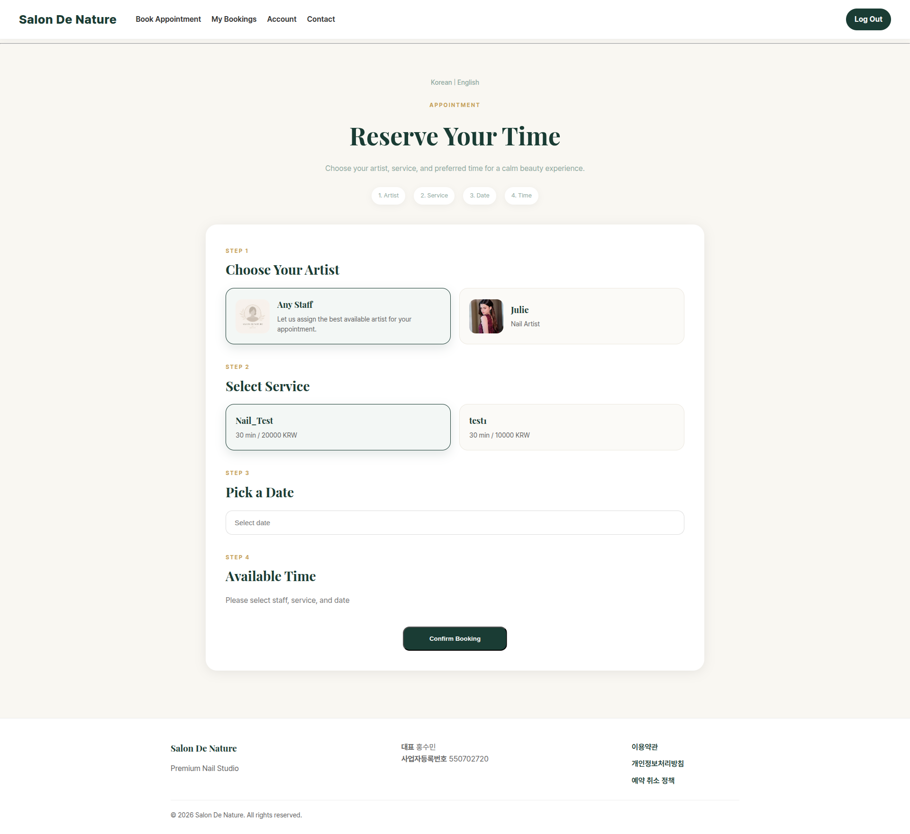
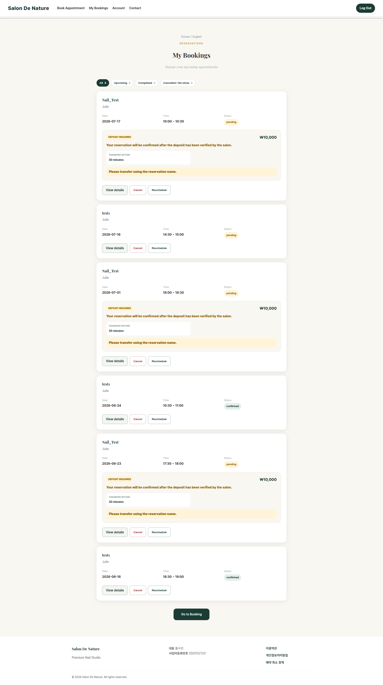

# 고객 화면 안내

원장님이 고객 문의에 답할 때 참고하는 절입니다.

## 19.1 고객 대시보드

**이동 경로:** 고객 로그인 완료

고객은 다음 기능을 사용할 수 있습니다.

- 예약하기
- 내 예약 확인
- 예약 상세 확인
- 예약 변경·취소
- 계정 비밀번호 변경
- 연락처·약관 확인

## 19.2 예약하기

**이동 경로:** 고객 로그인 → 상단 메뉴 `Book Appointment`

일반적인 예약 순서:

1. 서비스 선택
2. 담당 직원 선택
3. 날짜 선택
4. 예약 가능 시간 선택
5. 메모 입력
6. 예약 신청
7. 예약금 안내 확인

시간이 표시되지 않는 원인은 보통 다음 중 하나입니다.

- 직원이 해당 서비스를 담당하지 않음
- 직원 근무시간이 아님
- 휴무 또는 반차
- 기존 예약과 겹침
- 서비스 소요시간을 확보할 수 없음
- 서비스 또는 직원이 비활성 상태

## 19.3 내 예약

**이동 경로:** 고객 로그인 → 상단 메뉴 `My Bookings`

고객은 예약을 상태별로 확인할 수 있습니다.

- 예정
- 완료
- 취소
- 노쇼

예약 상세에서 예약 일정, 서비스, 직원, 가격, 예약금, 메모, 처리 이력을 확인할 수 있습니다. 운영 정책과 시간 제한에 따라 변경 또는 취소 버튼이 표시됩니다.

---
