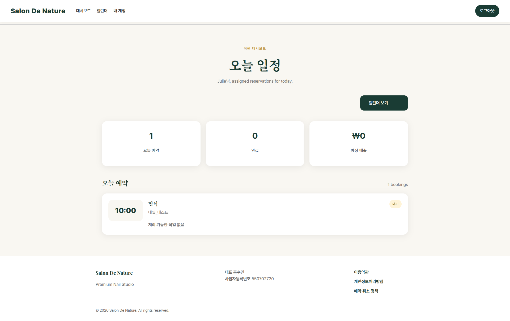
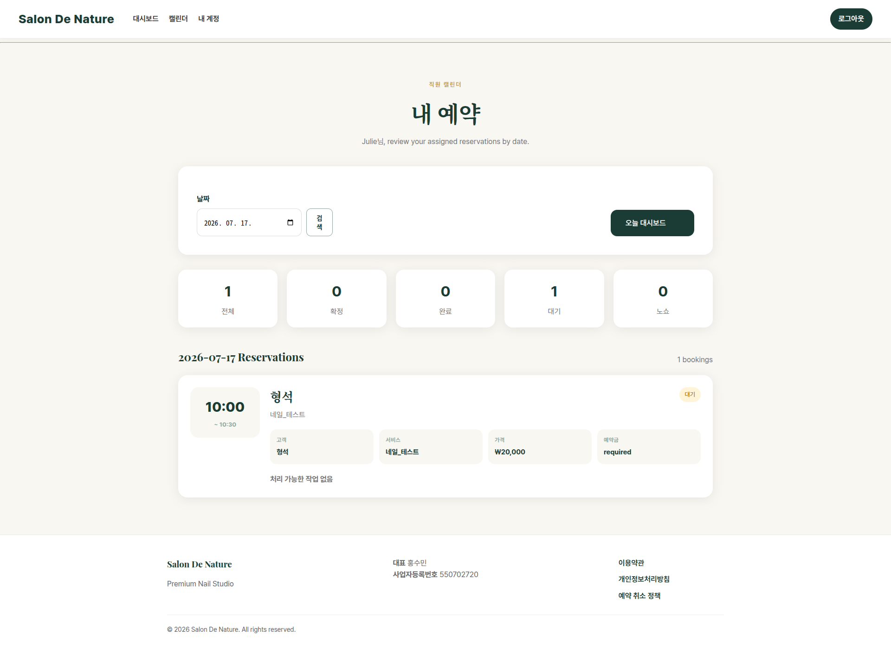
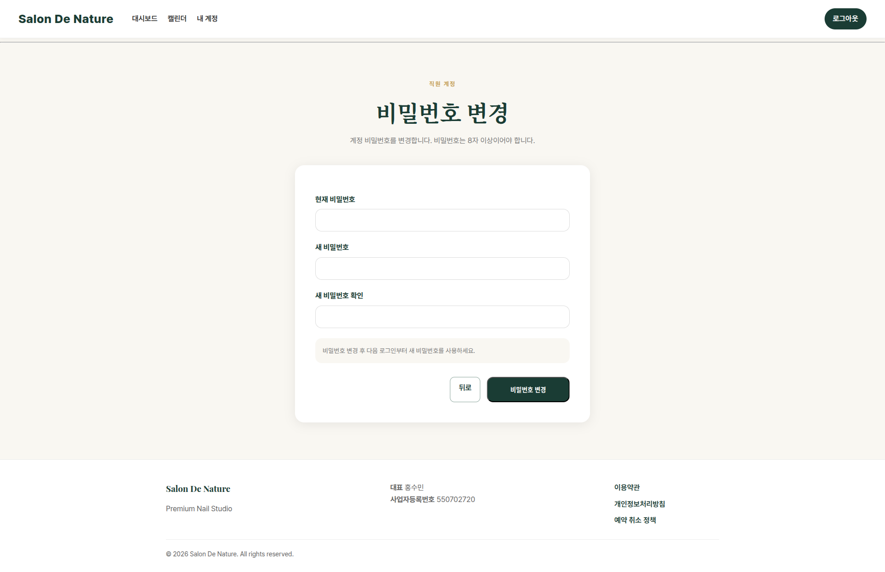

# 직원 화면 안내

## 20.1 직원 대시보드

**이동 경로:** 홈페이지 → 직원 로그인 → 로그인 완료

직원은 오늘 자신에게 배정된 예약을 확인합니다.

- 고객명
- 서비스
- 시간
- 상태
- 완료 처리

시술이 실제로 끝난 뒤 완료 처리해야 매출과 고객 방문 기록이 정확하게 반영됩니다.

## 20.2 직원 캘린더

**이동 경로:** 직원 로그인 → 상단 메뉴 `캘린더`

직원이 날짜별 자신의 예약을 확인하는 화면입니다. 전체 직원 예약이 아니라 로그인한 직원 본인의 예약만 표시됩니다.

## 20.3 직원 내 계정

**이동 경로:** 직원 로그인 → 상단 메뉴 `내 계정`

직원 프로필 확인 및 비밀번호 변경에 사용합니다. 프로필, 소개, 전문 분야 등 공개 정보는 원장이 직원 관리에서 수정합니다.

---
